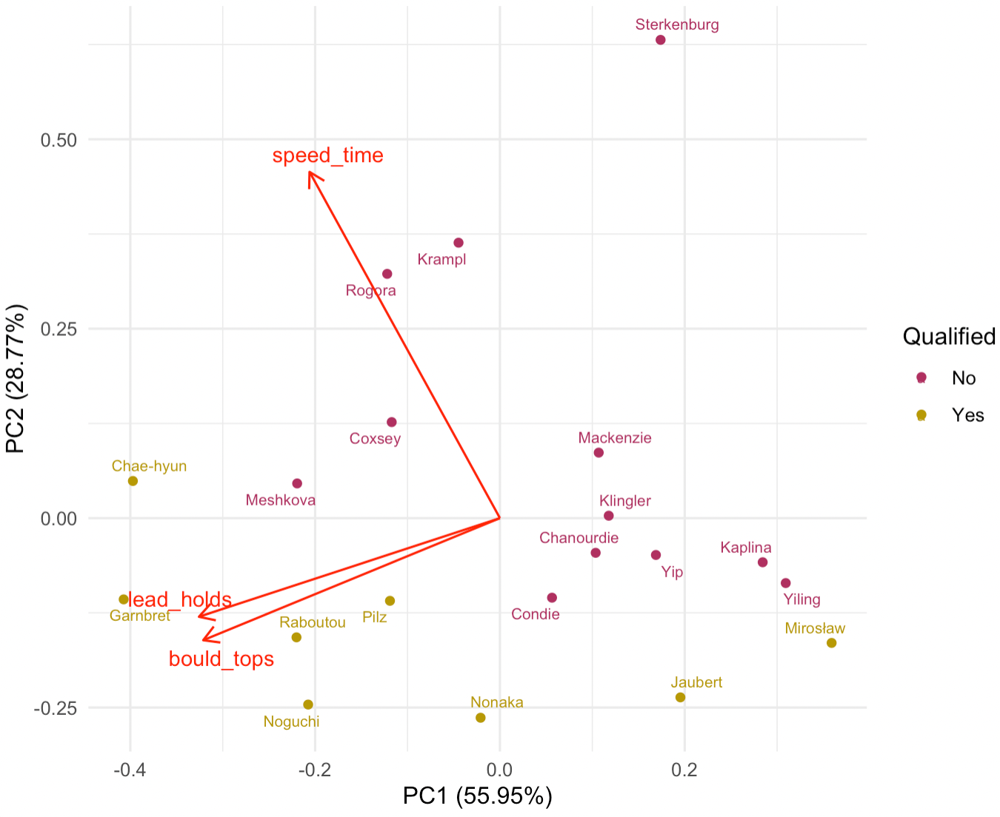

```{r setup, include=FALSE}
knitr::opts_chunk$set(message = FALSE,
                      echo = FALSE,
                      warning = FALSE,
                      fig.pos = "H")
```

\newpage

# Introduction

## Combined Competition Format

The 2020 Summer Olympics in Tokyo, Japan marked the first appearance of sport climbing on the Olympic stage. This sport is broken down into three disciplines: speed climbing, bouldering, and lead climbing. However, since only one set of Olympic medals is awarded to each gender event of sport climbing at Tokyo 2020, all three disciplines were included together, forming one single combined event. Under this "triathlon" format, every climber must compete in all three concentrations, and their individual score is determined as the product of the ranks across the three disciplines, with the lowest rank product declared the winner.

The decision to combine the three climbing events and only award one set of medals for both men's and women's events in the Olympics has received a large amount of criticism from climbing athletes all over the world. In a series of interviews conducted by Climbing Magazine in 2016 [@blanchard2016], a number of climbers shared their thoughts and concerns about the new Olympics climbing format. Legendary climber Lynn Hill compared the idea of combining speed climbing, bouldering, and lead climbing to "asking a middle distance runner to compete in the sprint". She then added "Speed climbing is a sport within our sport". Other climbers also hold the same opinion as Hill regarding speed climbing, using words and phrases like "bogus", "a bummer", "less than ideal", "not in support", and "cheesy and unfair" to describe the new combined competition format. Courtney Woods stated "Speed climbers will have the biggest disadvantage because their realm isn’t based on difficult movements". Mike Doyle believed "Honestly, the people that will suffer the most are the ones that focus only on speed climbing. Those skills/abilities don’t transfer as well to the other disciplines". The climbers also expressed their hope for a change in the competition format in future climbing tournaments.

## Rank-product Scoring System

At the 2020 Summer Olympics, both sport climbing competitions for male and female begin with 20 climbers who have previously qualified for the Olympics from qualifying events held in 2019 and 2020. All 20 athletes compete in each of the three disciplines in the qualification round, and their performances in each concentration are ranked from 1 to 20. A competitor's combined score is computed as the product of their ranks in the three events; specifically,
\begin{equation}
Score_i = R^S_i\times R^B_i\times R^L_i,
\end{equation} 
where $R^S_i$, $R^B_i$, and $R^L_i$ are the ranks of the $i$-th competitor in speed climbing, bouldering, and lead climbing, respectively.  

The 8 qualifiers with the lowest score in terms of product of ranks across the three disciplines advance to the finals, where they once again compete in all three events. Similar to qualification, the overall score for each contestant in the final stage is determined by multiplying the placement of speed, bouldering, and lead disciplines, and the athletes are ranked from 1 to 8. The climbers with the lowest, second lowest, and third lowest product of ranks in the final wins the gold, silver, and bronze medal, respectively. 

This type of scoring system heavily rewards high finishes and relatively ignores poor finishing results. For instance, if climber A finished 1st, 20th, and 20th and climber B finished 10th, 10th, and 10th, climber B would have a score of 1000 whereas climber A would have a much better score of 400, despite finishing last in 2 out of 3 of the events.

To the best of our knowledge, we know of no sporting event, team or individual, that uses the product of ranks to determine an overall rankings.  There are examples of team sports that use the rank-sum scoring to determine the winning team such as cross country, where the squad with the lowest sum of ranks of the top five runners is awarded with a first place finish. However, @hammond2007 and @boudreau2018 pointed out several problems with rank-sum scoring in cross country, including violations of social choice principles. In addition, some individual sports such as the decathlon and heptathlon rely on a sum of scores from the ten or seven events, however, these scores are not determined based on the ranks of the competitors. That is, a decathlete's score is entirely based upon their times, distances, and heights, and their overall score will be exactly the same if the times, distances, and heights remain the same regardless of the performance of other individuals [@westera2006]. Furthermore, there are other individual competitions consisted of several events combined that do base their scoring on ranks, such as crossfit competitions.  In each event, points are earned based on the competitor's rank in the event based on a scoring table, and a competitors final score is based on the sum of their scores across all the events [@crossfit2021].

In this paper, we perform statistical analysis to investigate the limitations of sport climbing's combined competition format and ranking system. We will evaluate whether the concerns of the professional climbers were valid. The manuscript is outlined as follows. We first begin with a simulation study to examine the key properties of rank-product scoring in sport climbing in Section 2. Our analyses of past competition data are then presented in Sections 3. Finally, in Section 4, we provide a summary of our main findings as well as some discussion to close out the paper.

# Simulation Study

In this section, we perform a simulation study to examine the rankings and scoring for climbers in both qualification and final rounds. For each round, we execute 10000 simulations, and this was accomplished by randomly assigning the ranks of each event to every participant, with the assumption that the ranks are uniformly distributed. After that, we calculate the total scores for every simulated round, as well as the final standings for the climbing athletes. The simulation results allow us to explore different properties of sport climbing's rank-product scoring system, including the distributions of total score for qualifying and final rounds, and the probabilities of advancing to the finals and winning a medal, given certain conditions. 

We are particularly interested in the following questions:

\vspace{-4mm}

*   For a qualifier, what is the probability that they advance to the final round (i.e. finish in the top 8 of qualification), given that they win any discipline?

*   For a finalist, what is the probability that they win a medal (i.e. finish in the top 3 of the finals), given that they win any discipline?

\vspace{-4mm}

Our simulation results, as illustrated by Figure 1, show that a climber is almost guaranteed to finish in the top 8 of qualification and advance to the final round if they win at least one of the three climbing concentrations (99.48% chance). Regarding the finals, a climber is also very likely to claim a top 3 finish and bring home a medal if they win any event (85.01% chance). Moreover, we notice that if a climber wins any discipline, they are also more likely to finish first overall than any other positions in the eventual qualification and final rankings. This shows how significant winning a discipline is to the overall competition outcome for any given climber. 

In addition, we are interested in examining the distribution of the total score for both qualification and final rounds. Figure 2 is a summary of the expected score for each qualification and final placement. According to our simulations, on average, the qualification score that a contestant should aim for in order to move on to the final round is 435 (for 8th rank). Furthermore, we observe that in order to obtain a climbing medal, the average scores that put a finalist in position to stand on the tri-level podium at the end of the competition are 10, 21, and 34 for gold, silver, and bronze medals, respectively. 

```{r}
library(tidyverse)
theme_set(theme_minimal())

climbing_sim <- function(nsim = 10000, nplay) {
  sims <- list()
  for (i in 1:nsim) {
    sims[[i]] <-
      bind_cols(
        player = 1:nplay,
        e1 = sample(1:nplay, replace = FALSE),
        e2 = sample(1:nplay, replace = FALSE),
        e3 = sample(1:nplay, replace = FALSE)
      ) %>%
      mutate(sim = i)
  }
  results <- bind_rows(sims) %>% 
    mutate(score = e1 * e2 * e3) %>% 
    group_by(sim) %>% 
    mutate(rank = rank(score, ties.method = "random")) %>%
    ungroup()
  
  return(results)
}

set.seed(1)
qual <- climbing_sim(nsim = 10000, nplay = 20)
final <- climbing_sim(nsim = 10000, nplay = 8)
```

```{r, fig.cap="The distributions for the probability of finishing at each rank of both qualification and final rounds, given that a climber wins any discipline, obtained from simulations. The probability of finishing exactly at each given rank is coded blue, whereas the probability of finishing at or below each given rank is coded maroon.", fig.height=3, fig.width=6}
final_dist <- final %>%
  filter(e1 == 1 | e2 == 1 | e3 == 1) %>%
  count(rank) %>%
  mutate(Probability = n / sum(n),
         Cumulative = cumsum(Probability)) %>%
  select(-n) %>%
  pivot_longer(!rank, names_to = "type") %>%
  mutate(round = "Final")

qual_dist <- qual %>%
  filter(e1 == 1 | e2 == 1 | e3 == 1) %>%
  count(rank) %>%
  mutate(Probability = n / sum(n),
         Cumulative = cumsum(Probability)) %>%
  select(-n) %>%
  pivot_longer(!rank, names_to = "type") %>%
  mutate(round = "Qualification")

final_dist %>%
  bind_rows(qual_dist) %>% 
  mutate(round = fct_relevel(round, "Qualification")) %>% 
  ggplot(aes(rank, value, fill = type)) +
  geom_col(position = "dodge") +
  facet_wrap(~ round, scales = "free") +
  scale_x_reverse(breaks = 1:11) +
  coord_flip() +
  labs(x = "Rank",
       y = "Probability Density",
       fill = "Distribution") +
  scale_fill_manual(values = c("maroon", "midnightblue")) +
  theme(panel.grid.major.y = element_blank()) +
  theme(legend.position = "bottom",
        legend.margin = margin(-5),
        legend.key.size = unit(0.4, "cm"))
```

\vspace{-4mm}

```{r, fig.cap="The average scores for the top 10 qualification ranks and all 8 final ranks, obtained from simulations.", fig.height=3, fig.width=6.2}
final %>% 
  group_by(rank) %>% 
  summarize(avg_score = mean(score)) %>%
  mutate(round = "Final",
         color = ifelse(rank == 1, "gold",
                        ifelse(rank == 2, "#C0C0C0",
                               ifelse(rank == 3, "#A77044", "lightblue")))) %>% 
  bind_rows(
    qual %>% 
      group_by(rank) %>% 
      summarize(avg_score = mean(score)) %>%
      filter(rank <= 10) %>% 
      mutate(round = "Qualification",
             color = ifelse(rank < 9, "maroon", "lightblue"))
  ) %>% 
  mutate(round = fct_relevel(round, "Qualification")) %>% 
  ggplot(aes(rank, avg_score, fill = color)) +
  geom_col() +
  geom_text(aes(label = ceiling(avg_score)), color = "black", size = 2.7, vjust = -0.3) +
  facet_wrap(~ round, scales = "free") +
  scale_x_continuous(breaks = 1:10) +
  scale_fill_identity() +
  labs(x = "Rank",
       y = "Average Score") +
  theme(panel.grid.major.x = element_blank())
```

# Analysis

## Correlation

Throughout this section, we will be using data from the Women's Qualification at the 2020 Summer Olympics [@datawiki] as a case study for examining the relationship between the climber rankings in each individual discipline and the overall standings. The main attributes of this data are the name and nationality of the climbers; the finishing place of climbers in speed climbing, bouldering, and lead climbing; the total score (which equals the product of the discipline ranks); the overall placement; and the performance statistics associated with speed (race time), bouldering (tops-zones-attempts), and lead climbing (highest hold reached). We utilize this data to analyze the correlations between the event ranks and final table position, as well as to look at how often the final orderings change if one athlete is removed and the remaining climbers' ranks and total scores in each discipline are re-calculated. 

Figure 3 is a multi-panel matrix of scatterplots of the ranks of the individual events and the final women's qualification standings. We use Kendall’s Tau [@kendall1938] as our measure of ordinal association between the ranked variables. Table 1 shows the Kendall rank correlation coefficients between the overall rank and the ranks of speed, bouldering, and lead disciplines; along with corresponding $95\%$ confidence intervals obtained from bootstrapping [@efron1986].

It is evidently clear that there exists a fairly strong and positive association between the final rank and the ranks of both bouldering ($\tau = 0.432$, $p$-value $=0.00735$, Bootstrapped $95\%$ CI: (0.107, 0.691)) and lead climbing ($\tau = 0.463$, $p$-value $=0.00378$, Bootstrapped $95\%$ CI: (0.112, 0.753)). This implies that climbers with high placements in both bouldering and lead also tend to finish at a higher ranking spot overall.

On the other hand, the correlation with the final rank is not as strong for speed climbing as the other two events ($\tau = 0.147$), and there is insufficient evidence for an association between the rank of speed climbing and the overall rank ($p$-value $=0.386$, Bootstrapped $95\%$ CI: (-0.191, 0.469)). Thus, this offers evidence that speed climbers are at a disadvantage under this three-discipline combined format, compared to those with expertise in the other two concentrations. This validates the concerns of climbers from the interviews mentioned in Section 1.1. 

```{r, fig.height=3, fig.width=6.5, fig.cap= "Scatterplots of overall rank and speed, bouldering, and lead ranks for Women's Qualification at Tokyo 2020."}
wq <- read_csv("https://raw.githubusercontent.com/qntkhvn/climbing/main/data/2020_olympics/wq.csv")

wq %>% 
  select(overall, speed, bouldering, lead) %>% 
  rename_with(str_to_title) %>% 
  pivot_longer(!Overall, 
               names_to = "Discipline",
               values_to = "Rank") %>%
  mutate(Discipline = factor(Discipline, levels = c("Speed", "Bouldering", "Lead"))) %>% 
  ggplot(aes(Rank, Overall)) +
  geom_point() +
  geom_smooth(span = 1, color = "darkblue", alpha = 0.2) +
  facet_wrap(~ Discipline) +
  theme(panel.grid.major.x = element_blank())
```

```{r, eval = FALSE}
wq %>% 
  select(overall, speed, bouldering, lead) %>% 
  cor(method = "kendall")

cor.test(wq$overall, wq$bouldering, method = "kendall")
cor.test(wq$overall, wq$lead, method = "kendall")
cor.test(wq$overall, wq$speed, method = "kendall")

library(NSM3)
set.seed(21)
kendall.ci(wq$overall, wq$bouldering, bootstrap=TRUE, B=1000)
kendall.ci(wq$overall, wq$lead, bootstrap=TRUE, B=1000)
kendall.ci(wq$overall, wq$speed, bootstrap=TRUE, B=1000)
```

```{r}
tribble(
  ~Discipline, ~`Kendall's Tau`, ~`Test Statistic`, ~`p-value`, ~ `Bootstrapped 95% CI`,
  "Speed", 0.147, 109, "0.386", "(-0.191, 0.469)",
  "Bouldering", 0.432, 136, "0.00735", "(0.107, 0.691)",
  "Lead", 0.463, 139, "0.00378", "(0.112, 0.753)"
) %>% 
  knitr::kable(caption = "Kendall's tau values, along with correlation test statistics, p-values, and bootstrapped 95% confidence intervals, for the overall rank and the rank of speed, bouldering, and lead disciplines of Women's Qualification at Tokyo 2020.")
```

In addition, we perform principal component analysis (PCA) to summarize the correlations among a set of observed performance variables associated with the three climbing disciplines. In particular, using the data from the Women's Qualification round at Tokyo 2020, we look at the racing time (in seconds) for speed; the number of successfully completed boulders ("tops"); and the number of holds reached for lead.

Figure 4 is a PCA biplot showing the PC scores of the climbers and loadings of the skill variables. We notice that the lead and bouldering performances strongly influence PC1, while speed time is the only variable contributing to PC2, separated from the other two skills. Moreover, since the two PC1 vectors are close and form a small angle, the two variables they represent (bouldering tops and lead holds reached) are positively correlated. This implies that a climber that does well in bouldering is also very likely to deliver a good performance in lead climbing.

```{r, out.width = "80%", fig.cap= "PCA Biplot for Women's Qualification at Tokyo 2020", fig.align="center"}

```

## Leave-one-climber-out Analysis

Another question that we are interested in investigating is "What would happen to the rankings if a single climber is removed?". There is a connection between this situation and the idea of independence of irrelevant alternatives (IIA). The IIA criterion is a property of a voting system which states that after a winner is determined, if one of the losing candidates drops out and the votes are recounted, there should not be a change in the winner. First mentioned by @arrow1951, the IIA condition is also known as Luce's choice axiom [@luce1959] in probability theory, and it has had a number of applications in the fields of decision theory, economics, and psychology over the years. We notice a link between the concept of IIA and the topic of ranking system in sports. As an illustration, suppose we have 3 players A, B, and C participating in a competition. If A finishes in the first place and C is later disqualified and removed, A should still win. If the original winner (A) loses the modified competition (with C removed), then the Independence of Irrelevant Alternatives has been violated. For our particular case, this sort of analysis can be helpful in examining the overall outcome for a climbing contest, specifically how a disqualification can affect the standings of medalists in the final round.

In the analysis that follows, we use data from the 2018 Youth Olympics Women's Final [@2018youth]. This event also implemented the combined format and rank-product scoring system, but only consisted of 6 climbers competing in the final, rather than 8 as Tokyo 2020. We modify the data as follows. After an athlete is dropped (by their rank), the new ranks for each discipline of the remaining players are re-calculated. The new final scores can then be obtained by multiplying the three event ranks, which then determines the new overall ranks.

Figure 5 shows the modified versions of the rankings after each ranked climber is excluded for the Women's Final at the 2018 Youth Olympics. We have clear evidence from this plot that removing a single climber changes the rankings drastically, especially in terms of the order of medalists. One particular interesting case is where an athlete's position changes when someone who originally finished behind them drops out. This situation is illustrated by panel 5 of the women's competition, where the fifth-place climber, Krasovskaia, was excluded; and Meul, whose actual final rank was fourth, moved up to the second spot and would have claimed the silver medal. Furthermore, this clearly demonstrates that the rank-product scoring method of Olympics sport climbing violates the IIA criterion. 

<!-- This reveals another issue of the sport climbing scoring system, which is that there is a dependency on irrelevant parties. -->


```{r, fig.height=3.6, fig.width=6.5, fig.cap="This figure illustrates the changes to the 2018 Youth Olympics Women's Final rankings when each climber is left out. Each panel represents the rank of the drop-out athlete, with 0 being the original final results. Each case with a change in rank orderings is highlighted by a black panel border, and any player with a rank change is represented by a red-filled bar"}

wf <- read_csv("https://raw.githubusercontent.com/qntkhvn/climbing/main/data/2018_youth_olympics/women_final.csv")

drop_rerank <- function(df) {
  rerank <- list()
  for (i in 1:nrow(df)) {
    rerank[[i]] <- df[-i, ] %>%
      mutate(rank_drop = i)
  }
  
  rerank_df <- df %>%
    mutate(rank_drop = 0) %>%
    bind_rows(rerank) %>%
    group_by(rank_drop) %>%
    mutate(
      speed = rank(speed),
      bould = rank(bould),
      lead = rank(lead),
      total = speed * bould * lead
    ) %>%
    arrange(total, .by_group = TRUE) %>%
    ungroup() %>%
    group_by(rank_drop, total) %>%
    mutate(
      speed_tb = ifelse(speed < lag(speed), 1, 0),
      bould_tb = ifelse(bould < lag(bould), 1, 0),
      lead_tb = ifelse(lead < lag(lead), 1, 0),
      tb = speed_tb + bould_tb + lead_tb,
      tb = ifelse(is.na(tb), 1, tb)
    ) %>%
    ungroup() %>%
    group_by(rank_drop) %>%
    arrange(total,-tb, .by_group = TRUE) %>%
    mutate(rank = row_number(),
           last = str_to_title(last))
  
  return(rerank_df)
}

drop_rerank(wf) %>% 
  mutate(last = fct_reorder(last, -rank),
         rank = as.factor(rank),
         rank_change = ifelse(
           rank_drop %in% c(0, 1, 4, 6) |
             rank_drop == 2 & rank %in% 1:3 |
             rank_drop == 3 & rank %in% c(1, 4, 5) |
             rank_drop == 5 & rank %in% c(1, 5),
           "no", "yes")) %>%
  ggplot(aes(x = last, y = total, fill = rank_change)) +
  geom_col(show.legend = FALSE) +
  geom_text(aes(label = rank), hjust = -0.2, size = 3, color = "black") +
  coord_flip() +
  geom_rect(aes(xmin = -Inf, xmax = Inf, ymin = -Inf, ymax = Inf),
            data = ~ filter(., rank_drop %in% c(2, 3, 5)), 
            color = "black", size = 1.5, fill = NA, inherit.aes = FALSE) +
  facet_wrap(~ rank_drop, nrow = 2, ncol = 4) +
  expand_limits(y = 62, x = 0:7) +
  scale_fill_manual(values = c("grey", "red")) +
  labs(y = "Score", x = NULL) +
  theme(axis.ticks = element_blank(),
        panel.grid.minor = element_blank())
```

# Conclusion and Discussion

In this paper, we examined the general features of the rank-product scoring system of sport climbing, in particular, the advancement probabilities and scores for the climbers. Most importantly, through analyses of past competition data, we pointed out several problems of the combined competition format and rank-product scoring system of sport climbing. First, combining the three disciplines speed, bouldering, and lead together into a "triathlon" competition format is putting speed climbers in an unfavorable position. Second, the sport climbing scoring method violates the independence of irrelevant alternatives. There is a dependency on irrelevant parties in this scoring method, as the orderings of medalists can be affected with a drop-out of a lower-ranked climber.

We suggest that speed climbing should have its own set of medals in future climbing tournaments, whereas bouldering and lead climbing can be combined into one event. In fact, it was confirmed that in the next Summer Olympics held in Paris in 2024, there will be two competitions and two sets of climbing medals for each gender event: combined lead and bouldering, and speed-only [@goh2020]. This is consistent with what we have shown, as bouldering and lead climbing performances are highly correlation with each other and with the overall result, whereas speed climbing should be separated from the combined format.

<!-- In closing, there are so many sports, similar to sport climbing, that have generally been untouched in terms of analytics. With the rise of statistics and data science applications in sports, we hope that more people will be interested in working on data problems related to sport climbing in order to make this sport better. One possible future work we could look into is turning the data we collected for this project into an accessible package or database of historical climbing competition results, which would be vital in promoting more engagements in the analytics of sport climbing. -->

# Supplementary Material {-}

All materials related to this manuscript are publicly available on `GitHub` at <https://github.com/qntkhvn/cmsac_rrc>. In addition, a series of blog posts on sport climbing can be found on the corresponding author's website at <https://qntkhvn.netlify.app/blog>.

# References