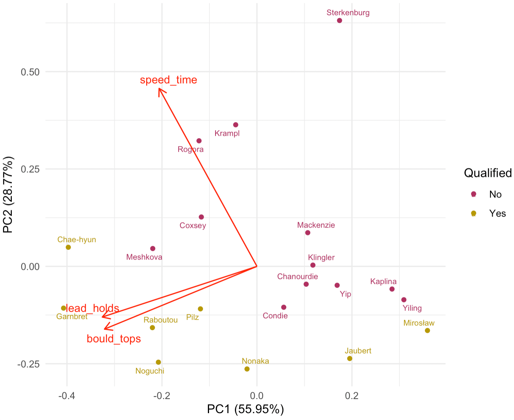

\vspace{-2mm}
```{=latex}
\keywords{word1, word2, word3}
```

```{r setup, include=FALSE}
knitr::opts_chunk$set(message = FALSE,
                      echo = FALSE,
                      warning = FALSE)
```

\setstretch{1.5}

\normalsize

\newpage

# Introduction

## Combined Competition Format

The 2020 Summer Olympics in Tokyo, Japan marked the first appearance of sport climbing on the Olympic stage. This sport is broken down into three distinct disciplines: speed climbing, bouldering, and lead climbing.  However, rather than granting a separate sets of medals for each discipline, the International Olympic Committee (IOC) only allowed one set of medals for each sex.  As a result, rather than choosing only one of the three disciplines all three disciplines were included together  forming one single combined event. Under this "triathlon" format, every climber must compete in all three concentrations, and their individual score is determined as the product of the ranks across the three disciplines with the lowest rank product declared the winner.

<!-- I like the initial version better -->

<!-- 
The 2020 Summer Olympics in Tokyo, Japan marked the first appearance of sport climbing on the Olympic stage. This sport is broken down into three distinct disciplines: speed climbing, bouldering, and lead climbing. However, <!--rather than granting separate sets of medals for each discipline, the International Olympic Committee (IOC) only allowed one set of medals each for men and women. Rather than choosing only one of the disciplines, all three disciplines were included together in a single combined event. Under this "triathlon" format, every climber must compete in all three concentrations in the qualifying round, and their individual score is determined as the product of their ranks across the three disciplines. The competitors with the lowest scores advance to the finals, where they again compete in all three disciplines under the same scoring format as in the qualifying round. The three with the lowest scores in the finals receive medals. 
-->


The first discipline, speed climbing, takes place on a standardized 15 meter high wall where competitors get one chance to try to reach the top of the wall as quickly as possible. At Tokyo 2020, speed climbing is being contested in a head-to-head format and under a single elimination bracket tournament structure.  Next, in bouldering, contestants have a fixed amount of time to attempt to reach the top of a climbing problem on a 4.5 meter-high wall in as few attempts as possible, without the use of ropes.<!--attempt to solve boulder problems, as they have a fixed amount of time to climb 4.5 meters high walls. The goal for this event is to complete as many courses in the fewest attempts as possible.--> Ties are further broken by the number of ``zone holds," which are holds approximately half way through each course. Finally, in lead climbing, each athlete is given six minutes and one attempt to climb as high as they can on a wall of height 15 meters. A climber gets one point for each hold that they reach, and the participant that manages to reach the highest point on the wall wins the lead discipline. If there is a tie, the athlete with the fastest elapsed time wins.

The decision to combine the three climbing events and only award one set of medals each for men and women in the Olympics has received a large amount of criticism from climbing athletes all over the world. In a series of interviews conducted by Climbing Magazine in 2016 [@blanchard2016], a number of climbers shared their thoughts and concerns about the new Olympic climbing format. Legendary climber Lynn Hill compared the idea of combining speed climbing, bouldering, and lead climbing to "asking a middle distance runner to compete in the sprint." She then added, "Speed climbing is a sport within our sport." Other climbers also hold the same opinion as Hill regarding speed climbing, using words and phrases like "bogus," "a bummer," "less than ideal," "not in support," and "cheesy and unfair" to describe the new combined competition format. Courtney Woods stated, "Speed climbers will have the biggest disadvantage because their realm isn’t based on difficult movements." Mike Doyle believed, "Honestly, the people that will suffer the most are the ones that focus only on speed climbing. Those skills/abilities don’t transfer as well to the other disciplines." The climbers also expressed their hope for a change in the competition format in future climbing tournaments.

<!-- This scoring format WILL change for Paris 2024 Olympics. 

Paris 2024 format: Bouldering and Lead will still be combined, speed will be separate.

Bouldering: (IFSC) - The max score is 100pts; 4 boulders in each round, each with 2 zones and 1 top; max score for each problem is 25pts: 3pts for 1st zone, 6pts (total?) for reaching 2nd zone, 25pts for top; 1pt deducted for each fall while attempting to top (not sure if this kicks in before or after reaching both zones).

Lead: (IFSC) - max score is 100pts; 1 lead route per round, only final 30 moves (holds?) will award pts; last 15 moves are 5pts each, the 10 before are 2pts each, and the 5 before those are 1pt each; all prior moves don't earn any points. 

-->

<!-- if going forward with this, it might be interesting to explore latent factors that distinguish boulderers from lead specialists -->

## Rank-product Scoring System

At the 2020 Summer Olympics, both sport climbing competitions for male and female begin with 20 climbers who have previously qualified for the Olympics from qualifying events held in 2019 and 2020. All 20 athletes compete in each of the three disciplines in the qualification round, and their performances in each concentration are ranked from 1 to 20. A competitor's combined score is computed as the product of their ranks in each of the three events; specifically,
\begin{equation} \label{eq:1}
Score_i = R^S_i\times R^B_i\times R^L_i,
\end{equation} 
where $R^S_i$, $R^B_i$, and $R^L_i$ are the ranks of the $i$-th competitor in speed climbing, bouldering, and lead climbing, respectively.  

<!-- maybe include that in preparation for the tokyo 2020 games, climbing competitions incorporated the scoring format, and the data used is from those competitions? -->

The 8 climbers with the lowest combined score <!--in terms of product of ranks across the three disciplines--> qualifiy for the finals where they once again compete in all three events. Similar to qualification, the overall score for each contestant in the final stage is determined by (\ref{eq:1})<!--by multiplying the placement of speed, bouldering, and lead disciplines-->, and the athletes are ranked from 1 to 8. The climbers with the lowest, second lowest, and third lowest combined score in the final wins the gold, silver, and bronze medal, respectively. 

<!-- The 8 qualifiers with the lowest score in terms of product of ranks across the three disciplines advance to the finals, where they once again compete in all three events. Similar to qualification, the overall score for each contestant in the final stage is determined by multiplying the placement of speed, bouldering, and lead disciplines, and the athletes are ranked from 1 to 8. The climbers with the lowest, second lowest, and third lowest product of ranks in the final wins the gold, silver, and bronze medal, respectively.  -->


This type of scoring system heavily rewards high finishes and relatively ignores poor finishing results. For instance, if climber A finished 1st, 20th, and 20th and climber B finished 10th, 10th, and 10th, climber B would have a score of 1000 whereas climber A would have a much better score of 400, despite finishing last in 2 out of 3 of the events.  

To the best of our knowledge, we know of no sporting event, team or individual, that uses the product of ranks to determine an overall rankings. There are examples of team sports that use the rank-sum scoring to determine the winning team such as cross country where the squad with the lowest sum of ranks of the top five runners is awarded with a first place finish. @hammond2007 and @boudreau2018 pointed out several problems with rank-sum scoring in cross country, including violations of social choice principles. In addition, some individual sports such as the decathlon and heptathlon rely on a sum of scores from the ten or seven events. However, these scores are not determined based on the ranks of the competitors. That is, a decathlete's score is entirely based upon their own times, distances, and heights, and their overall score will <!-- be exactly the same if the times, distances, and heights--> remain the same regardless of the performance of other individuals [@westera2006]. On the other hand <!--Furthermore-->, there are other individual competitions consisting of several events combined, such as crossfit, that do base their scoring on ranks. In each event, points are earned based on the competitor's rank in the event based on a scoring table, and a competitors final score is based on the sum of their scores across all the events [@crossfit2021]. 

<!--

@Parker2018 Scoring used to be done with the ABS10 Method.  This was later changed to the Top Score Method.  Until finally arriving at the geometric mean method (which is equivalent to rank product scoring when there are no ties).  This paper gives a toy example of a violation of IIA.  

@StinsonStinson2021 Compare the rank product score, additive scoring method (used prior to 2018), and the squarte root method. 
They show that in the finals of the men's competition that if rank sum was used instead of rank product, Narasaki would have won the gold medal.  However, with rank product, he finished fourth.  Interestingly, in the women's competition rank product and rank sum yield the same set of medal winners in the same order. 
- This paper proposes a new scoring system.  The scoring system they propose is the sum of the sqaure roots of the ranks.  I think an interesting question is how do you determine $f$ the exponent in the scoring system.    

-->

To date, there are several articles that have proposed alternative rank aggregation methods for the sport climbing combined format. First, @Parker2018 investigated a variety of approaches to rank and score climbing athletes, namely, geometric mean, Borda count, linear programming, geometric median, top score method, ABS10, and what they refer to as the "merged method." Eventually, they recommended the merged method, which is a combination of the top score and ABS10 methods as a reasonable scoring approach for climbing due to predictive power and satisfaction of social choice theory. More recently, @StinsonStinson2021 compared the current rank-product scoring method with rank-sum scoring and observed a dramatic change to the outcome of the men's sport climbing final at the 2020 Olympics when the sum of discipline rankings was used instead of the product. Specifically, Tomoa Narasaki, who finished fourth overall at Tokyo 2020, would have won the gold medal if rank-sum was used as the method of scoring instead of rank-product <!-- (\ref{eq:1}) -->. Furthermore, they proposed an alternative ranking-based scoring method that computes the sum of the square roots of each climber's rankings as their combined score.

As a side note, there are applications of the rank-product statistic in other fields. For example, the rank product statistic can be used to analyze replicated microarray experiments and identify differentially expressed genes. See @Breitling2004 for more information on this statistical procedure.

<!-- Maybe we move this little blurb to the end of the section.
I moved this to the end of the section.  You good with that?-->

In this paper, we perform statistical analysis to investigate the limitations of sport climbing's combined competition format and ranking system. We will evaluate whether the concerns of the professional climbers were valid. The manuscript is outlined as follows. We first begin with a simulation study to examine the key properties of rank-product scoring in sport climbing in Section 2. Our analyses of past competition data are then presented in Sections 3. Finally, in Section 4, we provide a summary of our main findings as well as some discussion to close out the paper.

<!-- In this paper, a statistical analysis was performed to investigate the limitations of sport climbing's combined competition format and ranking system to evaluate whether the concerns of the professional climbers were valid. The manuscript is outlined as follows. Section 2 contains a simulation study to examine the key properties of rank-product scoring in sport climbing. An analyses of past competition data are then presented in Section 3. Finally, in Section 4, a summary of the main findings as well as some discussion to close out the paper is presented. -->

<!-- We first begin with a simulation study to examine the key properties of rank-product scoring in sport climbing in Section 2. Our analyses of past competition data are then presented in Sections 3. Finally, in Section 4, we provide a summary of our main findings as well as some discussion to close out the paper. -->

\vspace{-5mm}

# Simulation Study

\vspace{-2mm}

In this section, we perform a simulation study to examine the rankings and scoring for climbers in both qualification and final rounds. There are two crucial assumptions to our simulation approach:

\vspace{-2mm}

*   **Uniform ranks**: The ranks within each discipline follow a discrete uniform distribution with bounds $[1, 20]$ and $[1, 8]$ for the qualification and final rounds, respectively.

*   **Correlation between events**: We want to introduce dependence in the ranks between the disciplines. In particular, based on the claim that "Speed climbing is a sport within our sport" mentioned in Section 1, a correlation between bouldering and lead climbing is assumed, whereas speed climbing is assumed completely independent of the other two events.

<!-- \vspace{-2mm} -->

In order to generate data that satisfy the simulation assumptions listed above, we rely on a framework proposed by @Demirtas2019 for inducing the correlation between bouldering and lead ranks with discrete uniform marginals. We choose Spearman's rank correlation coefficient [@spearman] as our measurement of association between the bouldering and lead disciplines. Our examination considers five different levels of correlation between bouldering and lead climbing: $0$ (no correlation), $0.25$ (low), $0.5$ (moderate), $0.75$ (high), and $1$ (perfect). 

For each correlation value, we first generated a population of size $N=100000$ consisting of randomly-drawn values from a standard uniform distribution for the three climbing events speed, bouldering, and lead. Using @Demirtas2019's algorithm, we first sorted the lead column in ascending order, then randomly picked out a fraction of the bouldering column equal to the desired correlation and ascending-sort these sampled values. Once the data have been sorted, we then randomly sampled either 20 (for qualification) or 8 (for final) rows from the population and ranked the values within each discipline. Here, our data generation process ensures that the final data were randomly selected from a population with a specified correlation structure between bouldering and lead. 

Finally, we repeated the same procedure $10000$ times for each correlation level.  After the simulations were complete, we calculated the total scores for every simulated round, as well as the final standings for the climbing athletes. The simulation results allow us to explore different properties of sport climbing's rank-product scoring system, including the distributions of total score for qualifying and final rounds, and the probabilities of advancing to the finals and winning a medal, given certain conditions.

<!-- need to polish this part again -->

<!-- I would write out a list with bullet points of the questions we want to answer here -->

<!-- After obtaining the simulation output, we summarized the advancement probabilities for both qualifying and final rounds, looking for trends over the correlation values. Figure 1 displays the probability of finishing at each rank of both qualification and final rounds for each of the 5 correlation values we considered, given that a climber wins any discipline. Notably speaking, the probabilities of finishing first in both climbing stages increase as the correlation magnitude goes up. The figure also reveals that if the two events lead and bouldering are perfectly correlated, the probability of a climber claiming first place overall after winning any event in qualification and final are within 0.5. This suggests that the competition becomes sort of a two-event contest rather than three-event, as for each round, winning any event essentially guarantees that a climber would finish first half of the times -->

After obtaining the simulation output, we summarized the advancement probabilities for both qualifying and final rounds, looking for trends over the correlation values. Figure 1 displays the probability of finishing first in qualification and finals for each of the 5 correlation values we considered, color coded by whether a climber wins the speed event or wins one of bouldering and lead concentrations. It is easy to see that for both rounds, as the correlation magnitude increases, the win probability given a first-place finish in lead climbing or bouldering also goes up. In contrast, the probability of winning each round given a speed victory decreases across the correlation levels. Moreover, if the two disciplines lead and bouldering are perfectly correlated, the top-ranked speed contestant in the final round only has a 20% chance to win gold, compared to a 91.3% chance for a finalist that ranks first in bouldering or lead climbing. This suggests a potentially unfair disadvantage for speed specialists when participating in a competition structure that possesses little skill crossover between speed and the other two climbing disciplines, as many believed.

<!-- It's more than suggesting it.  It literally would be a two event competition but with those events given heavier weighting than speed -->

```{r corr, fig.cap="The probabilities of winning qualification and final rounds, given that a climber finishes first in speed versus finishes first in bouldering or lead, obtained from simulation for each Spearman correlation value.", fig.height=3.3, fig.width=5.2}
library(tidyverse)
theme_set(theme_minimal())
sim_results <- read_csv("sim_results.csv")

sim_results %>% 
  group_by(rho, round) %>% 
  filter(e1 == 1) %>%
  count(rank) %>%
  mutate(Probability = n / sum(n),
         Cumulative = cumsum(Probability)) %>%
  ungroup() %>% 
  select(-n) %>% 
  pivot_longer(Probability:Cumulative, names_to = "prob") %>% 
  mutate(type = "Win Speed") %>% 
  bind_rows(
    sim_results %>% 
      group_by(rho, round) %>% 
      filter(e2 == 1 | e3 == 1) %>%
      count(rank) %>%
      mutate(Probability = n / sum(n),
             Cumulative = cumsum(Probability)) %>%
      ungroup() %>% 
      select(-n) %>% 
      pivot_longer(Probability:Cumulative, names_to = "prob") %>% 
      mutate(type = "Win Bouldering or Lead")
  ) %>% 
  filter(rank == 1 & prob == "Cumulative") %>% 
  mutate(round = fct_rev(round),
         type = fct_rev(type)) %>%
  ggplot(aes(rho, value, color = type)) +
  geom_line(size = 1) +
  geom_point(size = 2) +
  facet_wrap(~ round) +
  scale_y_continuous(breaks = seq(0, 1, 0.1)) +
  scale_color_manual(values = c("#FEBD18", "#922247")) +
  labs(color = "Probability",
       x = "Spearman Correlation",
       y = "Win Probability") +
  theme(legend.margin = margin(-5),
        legend.position = "bottom",
        legend.key.size = unit(0.4, "cm"),
        panel.grid.minor = element_blank()) +
  expand_limits(y = c(0, 1))
```

```{r}
climbing_sim_cor <- function(nsim = 10000, nplay, rho = 0) {
  sims <- list()
  #Number of points in the population 
  N <- 100000
  e1pop <- runif(N)
  e2pop <- runif(N)
  e3pop <- runif(N)
  
  #Pick some indexes
  ind <- sample(1:N, rho * N, replace = FALSE)
  e2pop[ind] <- sort(e2pop[ind])
  e3pop[ind] <- sort(e3pop[ind])
  
  for (i in 1:nsim) {
    
    #Sample nplay rows all together
    ind2 <- sample(1:N, nplay, replace = FALSE)
    
    sims[[i]] <-
      bind_cols(
        player = 1:nplay,
        e1 = rank(e1pop[ind2]),
        e2 = rank(e2pop[ind2]),
        e3 = rank(e3pop[ind2]), 
      ) %>%
      mutate(sim = i)
  }
  results <- bind_rows(sims) %>%
    mutate(score = e1 * e2 * e3) %>%
    group_by(sim) %>%
    mutate(rank = rank(score, ties.method = "random")) %>%
    ungroup()
  
  return(results)
}

set.seed(1)
qual <- climbing_sim_cor(nsim = 10000, nplay = 20, rho = 0.75)
final <- climbing_sim_cor(nsim = 10000, nplay = 8, rho = 0.75)
```

To further examine the advancement probabilities and scores for Olympics climbing, we use the simulated data with Spearman correlation of 0.75 as a case study. We are particularly interested in the following questions:

<!-- Why did we choose 0.75? Is this based on some empircal results? -->

\vspace{-2mm}

*   For a qualifier, what is the probability that they advance to the final round (i.e. finish in the top 8 of qualification), given that they win any discipline?

*   For a finalist, what is the probability that they win a medal (i.e. finish in the top 3 of the finals), given that they win any discipline?

<!-- \vspace{-2mm} -->

Our simulation results, as illustrated by Figure 2, show that a climber is almost guaranteed to finish in the top 8 of qualification and advance to the final round if they win at least one of the three climbing concentrations (99.3% chance). Regarding the finals, a climber is also very likely to claim a top 3 finish and bring home a medal if they win any event (85.3% chance). Moreover, we notice that if a climber wins any discipline, they are also more likely to finish first overall than any other positions in the eventual qualification and final rankings. This shows how significant winning a discipline is to the overall competition outcome for any given climber.

<!-- Did anyone win an event this year and NOT win a medal?  I think this happened with the guy who won speed, right? -->

In addition, we are interested in examining the distribution of the total score for both qualification and final rounds. Figure 3 is a summary of the expected score for each qualification and final placement. According to our simulations, on average, the qualification score that a contestant should aim for in order to move on to the final round is 456 (for 8th rank). Furthermore, we observe that in order to obtain a climbing medal, the average scores that put a finalist in position to stand on the tri-level podium at the end of the competition are 6, 17, and 33 for gold, silver, and bronze medals, respectively.

<!-- These results in the previous paragraph are all based on the corelation of 0.75 now? We should make it clear what are assumptions are.    -->

```{r probs, fig.cap="The distributions for the probability of finishing at each rank of both qualification and final rounds, given that a climber wins any discipline, obtained from simulations. The probability of finishing exactly at each given rank is coded blue, whereas the probability of finishing at or better than each given rank is coded maroon.", fig.height=3, fig.width=6}
final_dist <- final %>%
  filter(e1 == 1 | e2 == 1 | e3 == 1) %>%
  count(rank) %>%
  mutate(Probability = n / sum(n),
         Cumulative = cumsum(Probability)) %>%
  select(-n) %>%
  pivot_longer(!rank, names_to = "type") %>%
  mutate(round = "Final")
qual_dist <- qual %>%
  filter(e1 == 1 | e2 == 1 | e3 == 1) %>%
  count(rank) %>%
  mutate(Probability = n / sum(n),
         Cumulative = cumsum(Probability)) %>%
  select(-n) %>%
  pivot_longer(!rank, names_to = "type") %>%
  mutate(round = "Qualification")
final_dist %>%
  bind_rows(qual_dist) %>%
  mutate(round = fct_relevel(round, "Qualification")) %>%
  ggplot(aes(rank, value, fill = type)) +
  geom_col(position = "dodge") +
  facet_wrap(~ round, scales = "free") +
  scale_x_reverse(breaks = 1:11) +
  coord_flip() +
  labs(x = "Rank",
       y = "Probability Density",
       fill = "Distribution") +
  scale_fill_manual(values = c("maroon", "midnightblue")) +
  theme(panel.grid.major.y = element_blank(),
        legend.position = "bottom",
        legend.margin = margin(-5),
        legend.key.size = unit(0.4, "cm"))
```

```{r scores, fig.cap="The average scores for the top 10 qualification ranks and all 8 final ranks, obtained from simulations.", fig.height=3, fig.width=6.2}
final %>%
  group_by(rank) %>%
  summarize(avg_score = mean(score)) %>%
  mutate(round = "Final",
         color = ifelse(rank == 1, "gold",
                        ifelse(rank == 2, "#C0C0C0",
                               ifelse(rank == 3, "#A77044", "lightblue")))) %>%
  bind_rows(
    qual %>%
      group_by(rank) %>%
      summarize(avg_score = mean(score)) %>%
      filter(rank <= 10) %>%
      mutate(round = "Qualification",
             color = ifelse(rank < 9, "maroon", "lightblue"))
  ) %>%
  mutate(round = fct_relevel(round, "Qualification")) %>%
  ggplot(aes(rank, avg_score, fill = color)) +
  geom_col() +
  geom_text(aes(label = ceiling(avg_score)), color = "black", size = 2.7, vjust = -0.3) +
  facet_wrap(~ round, scales = "free") +
  scale_x_continuous(breaks = 1:10) +
  scale_fill_identity() +
  labs(x = "Rank",
       y = "Average Score") +
  theme(panel.grid.major.x = element_blank())
```

<!--  A major concern about the combined format for sport climbing is the disadvantage to speed specialists (those who focus primarily on minimizing their time to top the standardized speed route). It has been said that there is little skill crossover between speed climbing and the other two disciplines. This begs the question: "How likely is for a speed specialist to make it to finals and the podium?" Our simulated case study, proposing a .75 Spearman correlation between rankings for bouldering and lead, with speed climbing entirely independent suggests that a speed specialist (defined here to be the top rank in speed) still has a relatively high probability of making it to finals (98.42%) and the top-ranking speed climber in the finals has a 75.22% chance to win a medal. A contestant who has ranked first in bouldering or lead however, has a 99.80% chance to make it to the finals and a 94.06% probability of winning a medal. Further, the top-ranked speed contestant in finals only has an 25% chance to win gold, compared to a 66% chance for a contestant that ranks first in bouldering or lead.
-->

<!-- These simulation results tend to agree with empirical data. On an analysis of several competitions over the past 3 years which have used the combined format of the Tokyo 2020 Olympics, we noticed that 71% of women and 57% of men who ranked first in the speed finals earned a medal. This is in contrast to 86% of both women and men who ranked first in lead who won a medal, and 100% of both women and men who ranked first in bouldering won a medal.
-->

<!-- note: since it is still highly likely for the top speed climber to make it to finals (according to simulation results, it is probably not necessary to look at the probability that the top qualifier medals)
-->

\vspace{5mm}

# Analysis

## Correlation

Throughout this section, we will be using data from the Women's Qualification at the 2020 Summer Olympics [@datawiki] as a case study for examining the relationship between the climber rankings in each individual discipline and the overall standings. The main attributes of this data are the name and nationality of the climbers; the finishing place of climbers in speed climbing, bouldering, and lead climbing; the total score (which equals the product of the discipline ranks); the overall placement; and the performance statistics associated with speed (race time), bouldering (tops-zones-attempts), and lead climbing (highest hold reached). We utilize this data to analyze the correlations between the event ranks and final table position, as well as to look at how often the final orderings change if one athlete is removed and the remaining climbers' ranks and total scores in each discipline are re-calculated. 

Figure 4 is a multi-panel matrix of scatterplots of the ranks of the individual events and the final women's qualification standings. We use Kendall’s Tau [@kendall1938] as our measure of ordinal association between the ranked variables. Table 1 shows the Kendall rank correlation coefficients between the overall rank and the ranks of speed, bouldering, and lead disciplines; along with corresponding $95\%$ confidence intervals obtained from bootstrapping [@efron1986].

<!-- So, we were using kendall's tau before because I like it here.  But then I used spearman when creating the correlation structure because kendall's tau is hard to calculate on 100,000 observations.  Should we just alwasy use spearman?  Present both spearman and kendall?  Or just stick with kendall and not mention spearman at all here?  -->

It is evidently clear that there exists a fairly strong and positive association between the final rank and the ranks of both bouldering ($\tau = 0.432$, $p$-value $=0.00735$, Bootstrapped $95\%$ CI: (0.107, 0.691)) and lead climbing ($\tau = 0.463$, $p$-value $=0.00378$, Bootstrapped $95\%$ CI: (0.112, 0.753)). This implies that climbers with high placements in both bouldering and lead also tend to finish at a higher ranking spot overall.

On the other hand, the correlation with the final rank is not as strong for speed climbing as the other two events ($\tau = 0.147$), and there is insufficient evidence for an association between the rank of speed climbing and the overall rank ($p$-value $=0.386$, Bootstrapped $95\%$ CI: (-0.191, 0.469)). Thus, this offers evidence that speed climbers are at a disadvantage under this three-discipline combined format, compared to those with expertise in the other two concentrations. Hence, it appears that the concerns of the climbers mentioned in Section 1.1 may be valid. 

<!-- Let's say "This offers some evidence that the concersn of the climberts mentioned in Section 1.1 may be valid".  Good statisticians never make concrete claims.   -->

```{r scatter, fig.height=3, fig.width=6.5, fig.cap= "Scatterplots of overall rank and speed, bouldering, and lead ranks for Women's Qualification at Tokyo 2020."}
wq <- read_csv("https://raw.githubusercontent.com/qntkhvn/climbing/main/data/2020_olympics/wq.csv")
wq %>% 
  select(overall, speed, bouldering, lead) %>% 
  rename_with(str_to_title) %>% 
  pivot_longer(!Overall, 
               names_to = "Discipline",
               values_to = "Rank") %>%
  mutate(Discipline = factor(Discipline, levels = c("Speed", "Bouldering", "Lead"))) %>% 
  ggplot(aes(Rank, Overall)) +
  geom_point() +
  geom_smooth(span = 1, color = "darkblue", alpha = 0.2) +
  facet_wrap(~ Discipline) +
  theme(panel.grid.major.x = element_blank())
```

```{r, eval = FALSE}
wq %>% 
  select(overall, speed, bouldering, lead) %>% 
  cor(method = "kendall")
cor.test(wq$overall, wq$bouldering, method = "kendall")
cor.test(wq$overall, wq$lead, method = "kendall")
cor.test(wq$overall, wq$speed, method = "kendall")
library(NSM3)
set.seed(21)
kendall.ci(wq$overall, wq$bouldering, bootstrap=TRUE, B=1000)
kendall.ci(wq$overall, wq$lead, bootstrap=TRUE, B=1000)
kendall.ci(wq$overall, wq$speed, bootstrap=TRUE, B=1000)
```

```{r}
tribble(
  ~Discipline, ~`Kendall's Tau`, ~`Test Statistic`, ~`p-value`, ~ `Bootstrapped 95% CI`,
  "Speed", 0.147, 109, "0.386", "(-0.191, 0.469)",
  "Bouldering", 0.432, 136, "0.00735", "(0.107, 0.691)",
  "Lead", 0.463, 139, "0.00378", "(0.112, 0.753)"
) %>% 
  knitr::kable(caption = "Kendall's tau values, along with correlation test statistics, p-values, and bootstrapped 95% confidence intervals, for the overall rank and the rank of speed, bouldering, and lead disciplines of Women's Qualification at Tokyo 2020.")
```

In addition, we perform principal component analysis (PCA) to summarize the correlations among a set of observed performance variables associated with the three climbing disciplines. In particular, using the data from the Women's Qualification round at Tokyo 2020, we look at the racing time (in seconds) for speed; the number of successfully completed boulders ("tops"); and the number of holds reached for lead.

Figure 5 is a PCA biplot showing the PC scores of the climbers and loadings of the skill variables. We notice that the lead and bouldering performances strongly influence PC1, while speed time is the only variable contributing to PC2, separated from the other two skills. Moreover, since the two vectors representing the loadings for the bouldering and lead performances are close and form a small angle, the two variables they represent, bouldering tops and lead holds reached, are positively correlated. This implies that a climber that does well in bouldering is also very likely to deliver a good performance in lead climbing.

```{r pca, out.width = "80%", fig.cap= "PCA Biplot for Women's Qualification at Tokyo 2020.", fig.align="center"}

```

## Leave-one-climber-out Analysis

Another question that we are interested in investigating is "What would happen to the rankings if a single climber is removed?". There is a connection between this situation and the idea of independence of irrelevant alternatives (IIA). The IIA criterion is a property of a voting system which states that after a winner is determined, if one of the losing candidates drops out and the votes are recounted, there should not be a change in the winner. First mentioned by @arrow1951, the IIA condition is also known as Luce's choice axiom [@luce1959] in probability theory, and it has had a number of applications in the fields of decision theory, economics, and psychology over the years. We notice a link between the concept of IIA and the topic of ranking system in sports. As an illustration, suppose we have 3 players A, B, and C participating in a competition. If A finishes in the first place and C is later disqualified and removed, A should still win. If the original winner (A) loses the modified competition (with C removed), then the Independence of Irrelevant Alternatives has been violated. For our particular case, this type of analysis can be helpful in examining the overall outcome for a climbing contest, specifically how a disqualification can affect the standings of medalists in the final round.

In the analysis that follows, we use data from the 2018 Youth Olympics Women's Final [@2018youth]. This event also implemented the combined format and rank-product scoring system, but only consisted of 6 climbers competing in the final, rather than 8 like the Tokyo 2020 Olympics. We modify the data as follows: after an athlete is dropped (by their rank), the ranks for each discipline of the remaining players are re-calculated. The new totals can are then obtained as before, by multiplying the three event ranks, which then determines the new overall ranks.

Figure 6 shows the modified versions of the rankings after each ranked climber is excluded for the Women's Final at the 2018 Youth Olympics. We observe from this plot that removing a single climber changes the rankings drastically, especially in terms of the order of medalists. One particular interesting case is where an athlete's position changes when someone who originally finished behind them drops out. This situation is illustrated by panel 5 of the women's competition, where the fifth-place climber, Krasovskaia, was excluded; and Meul, whose actual final rank was fourth, moved up to the second spot and would have claimed the silver medal. Furthermore, this clearly demonstrates that the rank-product scoring method of Olympics sport climbing violates the IIA criterion. 

<!-- This is evidence that, under such a scoring format, the results of the competition can be influenced by factors irrelevant of individual athlete performance. -->

<!-- can/should we include what actually happened in the olympics? (Mawem was injured and unable to compete in finals)
-->

<!-- Make a less rtong statement: "We have clear evidence from this plot that removing a single climber changes the rankings drastically, especially in terms of the order of medalists." -->
<!-- Instead say something like "we observe some situations where the IIA is violated".  But what makes this interesting is that it's not that it was violated in a simulation, it's violated using real, actual data.   -->

<!-- This reveals another issue of the sport climbing scoring system, which is that there is a dependency on irrelevant parties. -->

```{r iia, fig.height=3.6, fig.width=6.5, fig.cap="This figure illustrates the changes to the 2018 Youth Olympics Women's Final rankings when each climber is left out. Each panel represents the rank of the drop-out athlete, with 0 being the original final results. Each case with a change in rank orderings is highlighted by a black panel border, and any player with a rank change is represented by a red-filled bar."}
wf <- read_csv("https://raw.githubusercontent.com/qntkhvn/climbing/main/data/2018_youth_olympics/women_final.csv")
drop_rerank <- function(df) {
  rerank <- list()
  for (i in 1:nrow(df)) {
    rerank[[i]] <- df[-i, ] %>%
      mutate(rank_drop = i)
  }
  
  rerank_df <- df %>%
    mutate(rank_drop = 0) %>%
    bind_rows(rerank) %>%
    group_by(rank_drop) %>%
    mutate(
      speed = rank(speed),
      bould = rank(bould),
      lead = rank(lead),
      total = speed * bould * lead
    ) %>%
    arrange(total, .by_group = TRUE) %>%
    ungroup() %>%
    group_by(rank_drop, total) %>%
    mutate(
      speed_tb = ifelse(speed < lag(speed), 1, 0),
      bould_tb = ifelse(bould < lag(bould), 1, 0),
      lead_tb = ifelse(lead < lag(lead), 1, 0),
      tb = speed_tb + bould_tb + lead_tb,
      tb = ifelse(is.na(tb), 1, tb)
    ) %>%
    ungroup() %>%
    group_by(rank_drop) %>%
    arrange(total,-tb, .by_group = TRUE) %>%
    mutate(rank = row_number(),
           last = str_to_title(last))
  
  return(rerank_df)
}
drop_rerank(wf) %>% 
  mutate(last = fct_reorder(last, -rank),
         rank = as.factor(rank),
         rank_change = ifelse(
           rank_drop %in% c(0, 1, 4, 6) |
             rank_drop == 2 & rank %in% 1:3 |
             rank_drop == 3 & rank %in% c(1, 4, 5) |
             rank_drop == 5 & rank %in% c(1, 5),
           "no", "yes")) %>%
  ggplot(aes(x = last, y = total, fill = rank_change)) +
  geom_col(show.legend = FALSE) +
  geom_text(aes(label = rank), hjust = -0.2, size = 3, color = "black") +
  coord_flip() +
  geom_rect(aes(xmin = -Inf, xmax = Inf, ymin = -Inf, ymax = Inf),
            data = ~ filter(., rank_drop %in% c(2, 3, 5)), 
            color = "black", size = 1.5, fill = NA, inherit.aes = FALSE) +
  facet_wrap(~ rank_drop, nrow = 2, ncol = 4) +
  expand_limits(y = 62, x = 0:7) +
  scale_fill_manual(values = c("grey", "red")) +
  labs(y = "Score", x = NULL) +
  theme(axis.ticks = element_blank(),
        panel.grid.minor = element_blank())
```

# Conclusion and Discussion

\vspace{-2mm}

In this paper, we examined the general features of the rank-product scoring system of sport climbing, in particular, the advancement probabilities and scores for the climbers. Most importantly, through analyses of past competition data, we pointed out several problems of the combined competition format and rank-product scoring system of sport climbing. First, combining the three disciplines speed, bouldering, and lead together into a "triathlon" competition format is putting speed climbers in an unfavorable position. Second, the sport climbing scoring method violates the independence of irrelevant alternatives. There is a dependency on irrelevant parties in this scoring method, as the orderings of medalists can be affected with a drop-out of a lower-ranked climber.

While we did not attempt to propose a new scoring method to replace rank-product scoring in combined climbing contest, we instead have a suggestion to modify the overall structure of the competition. In particular, we suggest that speed climbing should have its own set of medals in future climbing tournaments, whereas bouldering and lead climbing can be combined into one event. In fact, it was confirmed that in the next Summer Olympics held in Paris in 2024, there will be two competitions and two sets of climbing medals for each gender event: combined lead and bouldering, and speed-only [@goh2020]. This is consistent with what we have shown, as bouldering and lead climbing performances are highly correlation with each other and with the overall result, whereas speed climbing should be separated from the combined format.

\vspace{-5mm}

# Acknowledgements {-}

The authors would like to acknowledge the organizers of the 2021 UConn Sports Analytics Symposium and the 2021 Carnegie Mellon Sports Analytics Conference (CMSAC 2021) for the opportunities to present this work at its early stage and receive feedback.  In addition, we would like to express our special thanks to the anonymous reviewers of the Reproducible Research Competition at CMSAC 2021 for the insightful comments and suggestions that led to significant improvements in the paper.

# Supplementary Material {-}

All data and code for reproducing the analyses presented in this manuscript are publicly available on GitHub at <https://github.com/qntkhvn/cmsac_rrc>.

# References
